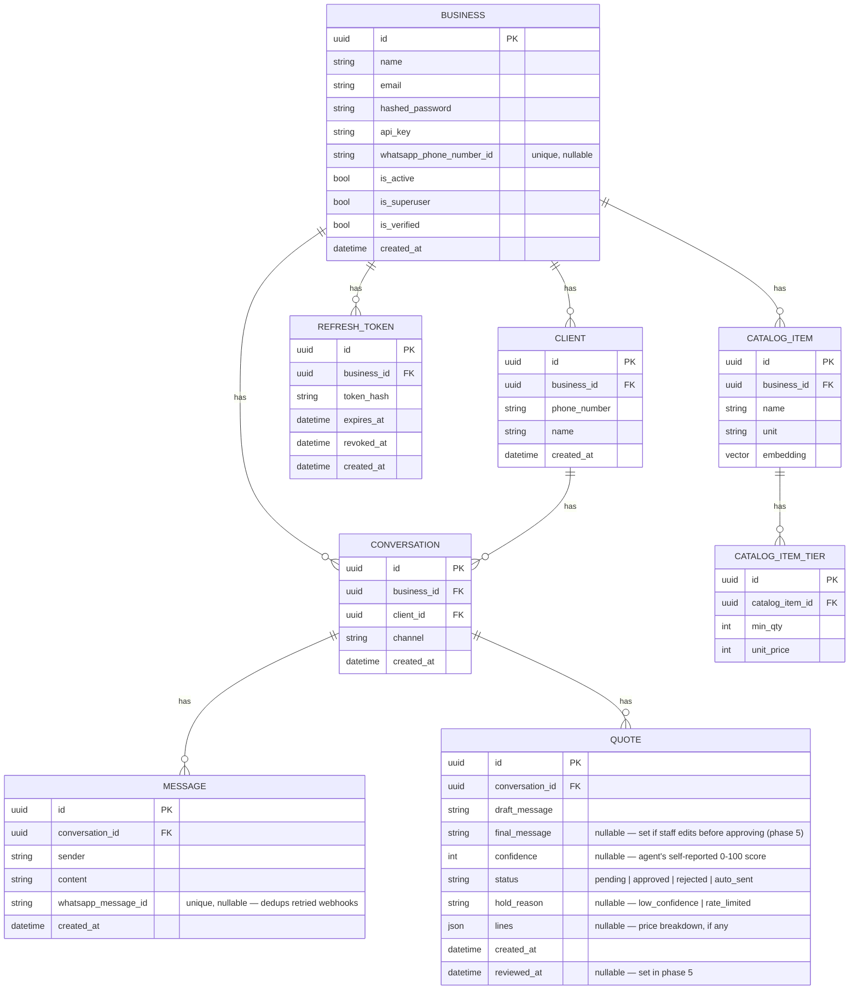
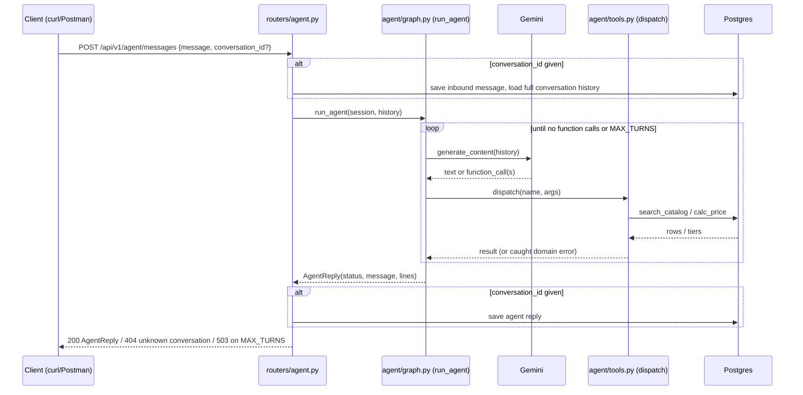
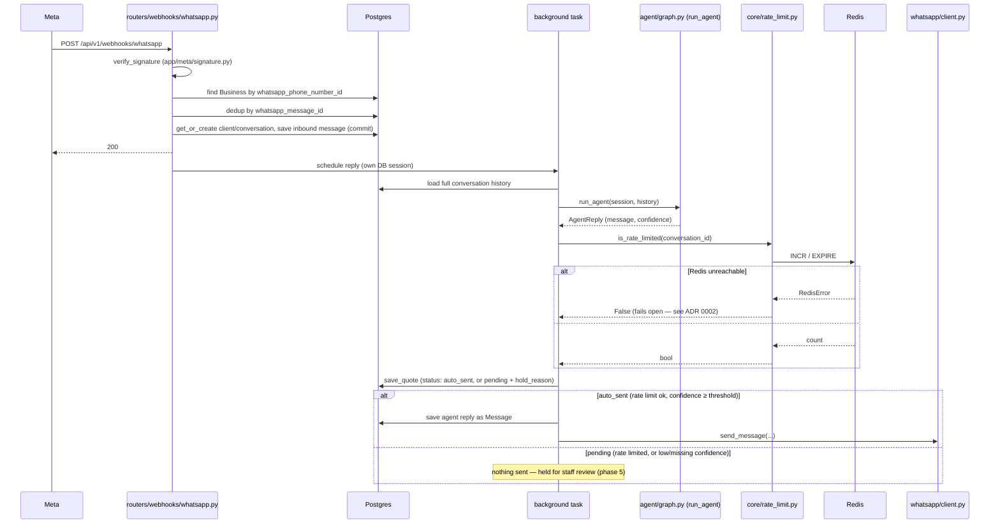

# Architecture

Current-state summary. Distilled from `docs/specs/` after each
phase ships — this file describes what's built, not what's planned (see
`ROADMAP.md`) and not why a hard-to-reverse decision was made (see
`docs/adr/`).

## Stack

FastAPI + PostgreSQL + pgvector. Gemini (`google-genai`, free tier) for
embeddings and function calling. SQLAlchemy + Alembic for the DB layer.
LangGraph for the agent loop. Redis for the guardrails rate limiter —
fails open (rate limiting stops, replies still send) if unreachable.

Locally, `db` and `redis` run in Docker (`pgvector/pgvector:pg17` on host
port `5433`, `redis:7-alpine` on host port `6380`); the API runs with
`uv run uvicorn app.main:app --reload` for fast reload. A full
`docker compose up` (API included, `.env.docker`) is for a prod-like run.

## Repo layout

Layer folders under `app/`: `models/`, `schemas/`, `services/`, `routers/`.
One file per feature, same name in every layer — e.g. `models/catalog.py`,
`schemas/catalog.py`, `services/catalog.py`, `routers/catalog.py`. Imports
flow one way: `routers` → `services` → `models`.

`app/llm/` is a package, not a layer — the only place a Gemini client gets
created. `app/agent/` is the same: `graph.py` (active, LangGraph),
`tools.py`, `prompts/`. `loop.py` is the frozen hand-written version — see
`docs/adr/0001-hand-written-loop-before-langgraph.md`.
`app/auth/` too: `users.py` (fastapi-users manager, JWT backend),
`refresh.py` (refresh token create/rotate/revoke).

`app/meta/` (`signature.py`, HMAC verification) and `app/whatsapp/`
(`schemas.py`, `client.py`) are one package per external integration, same
idea as `app/llm/` — Meta/WhatsApp's payload shapes stay out of
`app/schemas/`, which is only for our own API's request/response models.
`routers/webhooks/whatsapp.py` gets its own subpackage so Messenger/
Instagram get their own files and paths later without conflict.

`evals/` sits next to `tests/`, not inside it — evals score retrieval
quality (`recall@k`) and cost real API calls, so they run by hand.

## Data model

`(business_id, client_id, channel)` is unique on `CONVERSATION` — one
conversation per client per channel; no separate "closed" state yet. One
`QUOTE` row is written per agent reply, whether it auto-sent or was held.

## Request flow (current)

`run_agent` takes a ready-made history (`list[types.Content]`), not a bare
string — it doesn't know or care whether that history came from one
throwaway message or a saved conversation. Building that history is the
caller's job: `messages_to_history` (`app/agent/graph.py`) converts saved
`Message` rows into Gemini's format (`client`/`staff` → `"user"`,
`agent` → `"model"`). Without a `conversation_id`, the endpoint behaves as
before — one message in, one reply out, nothing saved.
`ItemNotFound` and `BelowMinimumQuantity` are caught inside `dispatch` and
fed back to Gemini as text instead of crashing the loop.

## Request flow — WhatsApp webhook

The agent's reply happens after the `200` is returned — Meta doesn't wait
for it. The background task opens its own DB session
(`get_session_factory`, overridable in tests); the request's session is
gone by the time it runs. A failure in the background task is logged, not
retried — see `docs/specs/2026-09-02-whatsapp-webhook-design.md` for the
accepted gap and why (Hardening phase closes it).

The rate limit and confidence check (guardrails) are new. Every reply
writes a `Quote` row, whether it sent or was held; there's no
staff-facing way to review a held one yet (phase 5, once the dashboard
exists).
