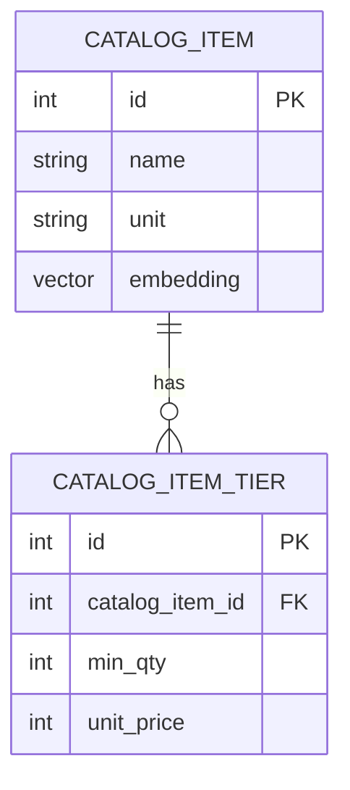
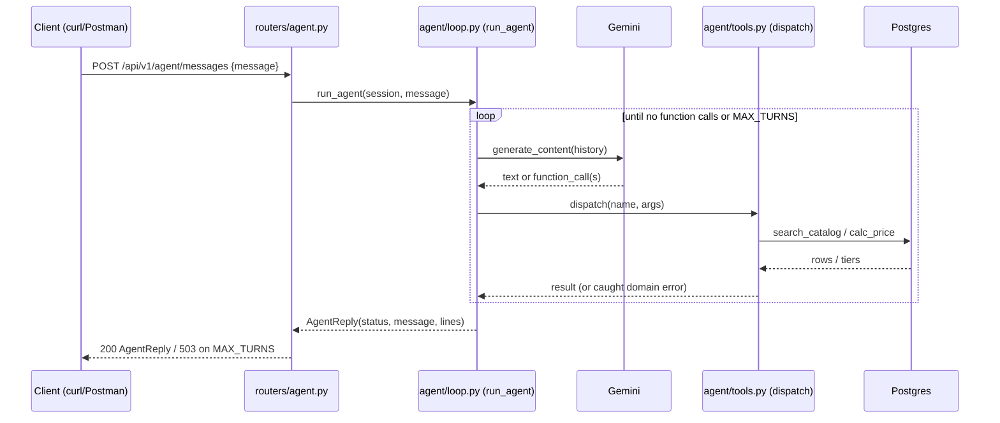

# Architecture

Current-state summary. Distilled from `docs/specs/` after each
phase ships — this file describes what's built, not what's planned (see
`ROADMAP.md`) and not why a past call was made (see `docs/adr/`).

## Stack

FastAPI + PostgreSQL + pgvector. Gemini (`google-genai`, free tier) for
embeddings and function calling. SQLAlchemy + Alembic for the DB layer.

Locally, only `db` runs in Docker (`pgvector/pgvector:pg17`, host port
`5433`); the API runs with `uv run uvicorn app.main:app --reload` for fast
reload. A full `docker compose up` (API included, `.env.docker`) is for a
prod-like run.

## Repo layout

Layer folders under `app/`: `models/`, `schemas/`, `services/`, `routers/`.
One file per feature, same name in every layer — e.g. `models/catalog.py`,
`schemas/catalog.py`, `services/catalog.py`, `routers/catalog.py`. Imports
flow one way: `routers` → `services` → `models`.

`app/llm/` is a package, not a layer — the only place a Gemini client gets
created. `app/agent/` is the same: `loop.py`, `tools.py`, `prompts/`.

`evals/` sits next to `tests/`, not inside it — evals score retrieval
quality (`recall@k`) and cost real API calls, so they run by hand.

## Data model

No conversation/tenant tables yet — see `ROADMAP.md`, software phase 1.

## Request flow (current)

Single message in, single reply out — no conversation persistence yet.
`ItemNotFound` and `BelowMinimumQuantity` are caught inside `dispatch` and
fed back to Gemini as text instead of crashing the loop.

## Decisions already made

- **Agent loop**: hand-written `while` loop first. A LangGraph rebuild
  comes later as an explicit comparison, not a replacement — see
  `docs/adr/0001-hand-written-loop-before-langgraph.md`.
- **Data**: portfolio project — fake catalog, fake client messages only.
  Never put a real client's data through the Gemini key (free tier: Google
  can use it).

These aren't open questions — check with Amine before proposing a
different stack or approach.
